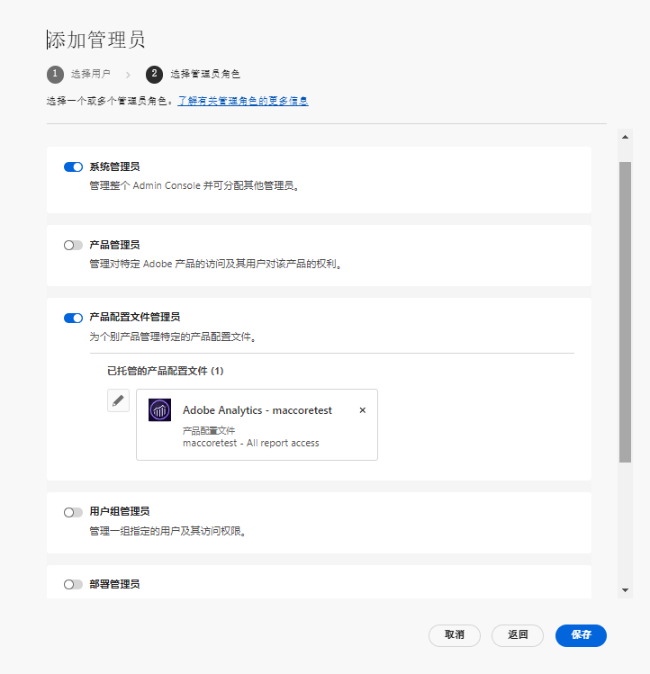

# 管理角色

使用 Adobe Admin Console，组织可以定义灵活的管理层级结构，以便对 Adobe 产品的访问和使用进行精细管理。一个或多个系统管理员位于层级结构的顶部，他们是在企业注册过程中配置的。这些系统管理员可以将职责委派给其他管理员，同时仍保留总体控制权。

管理角色为企业提供以下关键优势：

* 控制管理责任的下放
* 快速查看产品分配情况（按用户和按产品）
* 为产品管理员分配配额的功能

## 管理层级

适用于：Adobe 企业客户。

管理层级可用于满足企业的独特要求。例如，企业可以指定不同的管理员来管理 Adobe Creative Cloud 和 Adobe Marketing Cloud 产品的权限。或者，企业可以让不同的管理员来管理属于不同业务部门的用户权限。

>[!NOTE]
>
>管理层级不适用于团队客户。团队客户有&#x200B;**系统管理员**&#x200B;角色。合同所有者（_以前称为&#x200B;**主管理员**_）是系统管理员，有权访问合同详细信息和计费历史记录。如果您是当前合同所有者，则可以提名现有系统管理员（_&#x200B;以前称为&#x200B;**辅助管理员**_）作为合同所有者。

_管理员角色层级_

| 角色 | 描述 |
|--- |--- |
| **系统管理员** | 组织的超级用户；有权在 Admin Console 中执行所有管理任务。 此外，还有权将以下管理功能委派给其他用户：产品管理员、产品配置文件管理员、用户组管理员、部署管理员和支持管理员。 |
| **产品管理员** | 管理分配给该管理员的产品以及所有相关的管理功能，包括：<ul><li>创建产品配置文件</li><li>将用户和用户组添加到组织，但不移除这些</li><li>在产品配置文件中添加或移除用户和用户组</li><li>在产品配置文件中添加或移除产品配置文件管理员</li><li>在产品中添加或移除其他产品管理员</li><li>在群组中添加或移除群组管理员</li></ul> |
| **产品配置文件管理员** | 管理分配给该管理员的产品配置文件描述以及所有相关的管理功能，包括：<ul><li>将用户和用户组添加到组织，但不移除这些</li><li>在产品配置文件中添加或移除用户和用户组</li><li>通过产品配置文件为用户和用户组分配或撤消产品权限</li><li>管理产品配置文件的用户和用户组的产品角色 |
| **用户组管理员** | 管理分配给该管理员的用户组描述以及所有相关的管理功能，包括：<ul><li>在群组中添加或移除用户</li><li>在群组中添加或移除用户组管理员 |
| **部署管理员** | 创建、管理和部署软件包和更新以供最终用户使用。 |
| **支持管理员** | 有权访问支持相关信息（如客户报告的问题报告）的非管理角色。 |
| **存储管理员** | 负责组织的存储管理。管理员可以查看活动用户和不活动用户的存储使用情况，并将内容转移给其他收件人。 |

有关每个管理员角色的权限和特权的详细列表，请参阅[权限](#enterprise-admins-permissions-matrix)。

## 添加企业管理员 角色 {#add-enterprise-role}

适用于：Adobe 企业客户。

作为管理员，您可以向其他用户分配管理员角色，为其授予您所拥有的相同权限，或者授予层级结构中您的管理员角色之下某角色的权限，如[上文](#administrative-hierarchy)所述。例如，作为产品管理员，您可以授予用户产品管理员权限或产品配置文件管理员权限，但不能授予部署管理员权限。有关 Admin Console 的权限，请参阅[权限矩阵](#enterprise-admins-permissions-matrix)。

要添加或邀请管理员：

1. 在 [Admin Console](https://adminconsole.adobe.com/) 中，选择&#x200B;**用户** > **管理员**。

   或者，转到“相关产品”、“产品配置文件”或“用户组”，然后导航到&#x200B;**管理员**&#x200B;选项卡。

1. 单击&#x200B;**添加管理员**。
1. 输入名称或电子邮件地址。您可以搜索现有用户，或通过指定有效的电子邮件地址并在屏幕上填写信息来添加新用户。
1. 单击&#x200B;**下一步**。出现管理员角色列表。

>[!NOTE]
>
>* 此屏幕上的选项取决于您的帐户和管理员角色。您可以授予您所拥有的相同权限，或者授予层级结构中您下方某角色的权限。
>* 作为团队的系统管理员，您只能分配一个管理员角色：系统管理员。

1. 选择一个或多个管理员角色。
1. 对于产品管理员、产品配置文件管理员和用户组管理员等管理员类型，请分别选择特定的产品、配置文件和群组。

>[!NOTE]
>
>对于产品配置文件管理员，您可以包含多个产品的配置文件。

1. 查看分配给用户的管理员角色，然后单击 **保存**。

用户会收到来自 `message@adobe.com` 的有关新管理权限的电子邮件邀请。

用户必须单击&#x200B;**开始使用**（电子邮件）以加入组织。如果新管理员不使用&#x200B;**开始使用**&#x200B;链接，则将无法登录到 Admin Console。

在登录过程中，如果用户还没有 Adobe 配置文件，则可能会要求其设置 Adobe 配置文件。如果用户的电子邮件地址关联了多个配置文件，则用户必须选择“加入团队”（如果出现提示），然后选择与新组织关联的配置文件。

## 添加团队管理员 {#add-admin-teams}

适用于：Adobe 团队客户。

作为管理员，您可以将系统管理员角色分配给其他用户，并授予他们您所拥有的相同权限。

添加或邀请系统管理员：

1. 在 Admin Console 中，选择&#x200B;**用户** > **管理员**。

   此时会显示现有管理员的列表。

1. 单击&#x200B;**添加管理员**。

   显示&#x200B;**添加管理员**&#x200B;屏幕。

1. 输入名称或电子邮件地址。您可以搜索现有用户，或通过指定有效的电子邮件地址并在屏幕上填写信息来添加新用户。

   默认情况下，系统管理员处于选中状态。

1. 单击&#x200B;**保存**。

由于团队组织中的所有用户都是业务 ID 用户，因此他们会收到来自 `message@adobe.com` 的有关新管理权限的电子邮件邀请。
用户必须单击电子邮件中的“开始使用”以加入组织。

在登录过程中，如果用户还没有 Adobe 配置文件，则可能会要求其设置 Adobe 配置文件。如果用户的电子邮件地址关联了多个配置文件，则用户必须选择“加入团队”（如果出现提示），然后选择与新组织关联的配置文件。

## 编辑企业管理员角色

适用于：Adobe 企业客户。

作为管理员，您可以将管理员角色编辑改为管理员层级结构中您下方的其他管理员。例如，您可以移除其他管理员的管理员权限。

要编辑管理员角色：

1. 在 Admin Console 中，选择&#x200B;**用户** > **管理员**。此时会显示现有管理员的列表。

   或者，转到“相关产品”、“产品配置文件”或“用户组”，然后导航到&#x200B;**管理员**&#x200B;选项卡。

1. 单击要编辑的管理员的名称。
1. 在&#x200B;**用户详细信息**&#x200B;中，单击 **管理权限**&#x200B;部分的 ，并选择&#x200B;**编辑管理员权限**。

   

1. 编辑管理员权限并保存更改。

## 编辑团队管理员角色

适用于：Adobe 团队客户。

作为团队系统管理员，您可以移除其他管理员的系统管理员权限。

要撤消系统管理员权限：

1. 在 Admin Console 中，选择&#x200B;**用户** > **管理员**。

   此时会显示现有管理员的列表。

1. 在用户详细信息中，单击&#x200B;**管理权限**&#x200B;部分右侧的 ，并选择 **编辑管理权员权限**。

   

1. 编辑管理员权限并保存更改。

## 移除管理员

适用于：Adobe 团队企业客户。

1. 要撤消管理员权限，请选择一个用户，然后单击 **移除管理员**。

>[!NOTE]
>
>移除管理员不会从 Admin Console 中删除用户，而是仅移除与管理员角色关联的权限。

## 企业管理员权限矩阵

适用于：Adobe 企业客户。

下表列出了不同类型管理员的所有权限，并按以下功能方面进行分类：

### 身份管理

| 权限 | 系统管理员 | 支持管理员 |
|--- |--- |--- |
| 添加域（请求/声明域） | ✔ |  |
| 查看域和域列表 | ✔ |  |
| 管理域加密密钥 | ✔ |  |
| 管理默认组织密码策略 | ✔ |  |
| 查看默认组织密码策略 | ✔ |  |

### 用户管理

| 权限 | 系统管理员 | 支持管理员 |
|--- |--- |--- |
| 将用户添加到组织 | ✔ |  |
| 从组织中移除用户 | ✔ |  |
| 查看用户详细信息和列表 | ✔ |  |
| 编辑用户配置文件 | ✔ |  |
| 将产品配置文件添加到用户或组 | ✔ |  |
| 从用户或组移除产品配置文件 | ✔ |  |
| 将产品配置文件添加到多个用户 | ✔ |  |
| 查看用户的产品配置文件 | ✔ |  |
| 查看产品用户列表 | ✔ |  |
| 将用户批量添加到组织 | ✔ |  |

### 管理员管理

| 权限 | 系统管理员 | 支持管理员 |
|--- |--- |--- |
| 授予用户组织管理员权限 | ✔ |  |
| 撤销用户的组织管理员权限 | ✔ |  |
| 授予用户产品许可证管理员权限 | ✔ |  |
| 撤消用户的产品许可证管理员权限 | ✔ |  |
| 授予用户部署管理员权限 | ✔ |  |
| 撤销用户的部署管理员权限 | ✔ |  |
| 授予用户用户组管理员权限 | ✔ |  |
| 撤消用户的用户组管理员权限 | ✔ |  |
| 授予用户产品所有者管理员权限 | ✔ |  |
| 撤消用户的产品所有者管理员权限 | ✔ |  |

### 产品许可证配置管理

| 权限 | 系统管理员 | 支持管理员 |
|--- |--- |--- |
| 授予组织产品权利 |  |  |
| 移除组织的产品权利 |  |  |
| 查看组织拥有的许可证总数 | ✔ |  |
| 查看可用产品和产品系列 | ✔ |  |
| 编辑产品许可证描述/数据 | ✔ |  |
| 为用户配置产品许可证 | ✔ |  |
| 为用户取消配置产品许可证 | ✔ |  |
| 添加新产品许可证配置 | ✔ |  |
| 编辑产品许可证服务配置 | ✔ |  |
| 删除产品许可证服务配置 | ✔ |  |
| 移除用户的产品访问权限（从所有配置中移除） | ✔ |  |

### 存储管理

| 权限 | 系统管理员 | 支持管理员 |
|--- |--- |--- |
| 查看活动和不活动的用户文件夹 | ✔ |  |
| 删除不活动的用户文件夹和转移内容 | ✔ |  |

### 部署

| 权限 | 系统管理员 | 支持管理员 |
|--- |--- |--- |
| 查看/使用“包”选项卡 | ✔ |  |

### 支持

| 权限 | 系统管理员 | 支持管理员 |
|--- |--- |--- |
| 查看“支持”选项卡 | ✔ |  |
| 管理支持案例 | ✔ | ✔ |

### 用户组管理

| 权限 | 系统管理员 | 支持管理员 |
|--- |--- |--- |
| 创建用户组 | ✔ |  |
| 移除用户组 | ✔ |  |
| 将用户添加到用户组 | ✔ |  |
| 从用户组中移除用户 | ✔ |  |
| 将用户组分配到产品许可证 | ✔ |  |
| 从产品许可证中移除用户组 | ✔ |  |
| 查看用户组成员 | ✔ | ✔ |
| 查看用户组列表 | ✔ | ✔ |
