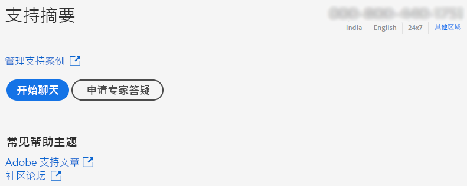

# 企业和团队 | 联系 Adobe 客户关怀

要联系 Adobe 客户关怀，请导航到 [Admin Console](https://adminconsole.adobe.com/) 中的&#x200B;**支持**&#x200B;选项卡。

在 [Admin Console](https://adminconsole.adobe.com/) 中的&#x200B;**支持**&#x200B;选项卡，您可以通过简单易用的界面访问各种支持选项。“支持”选项卡中的可用选项取决于您的订阅计划。有关更多信息，请单击您的订阅计划对应的&#x200B;**了解更多**。

如果不确定自己的订阅计划，请导航到在 [Admin Console](https://adminconsole.adobe.com/) 上的&#x200B;**支持**&#x200B;选项卡，并将您的视图与下图进行比较。然后，单击相应的&#x200B;**了解更多**&#x200B;链接。

## 对于团队帐户

<!--
[Learn more](https://helpx.adobe.com/enterprise/using/support-for-teams.html)
-->

## 对于企业帐户

<!--
[Learn more](https://helpx.adobe.com/enterprise/using/support-for-enterprise.html)
-->

## 对于 Experience Cloud

<!--
[Learn more](https://www.adobe.com/go/ac_ec_not_supported_en)
-->
