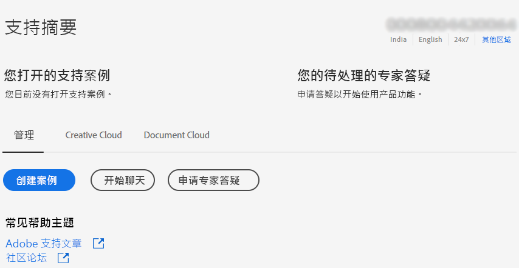
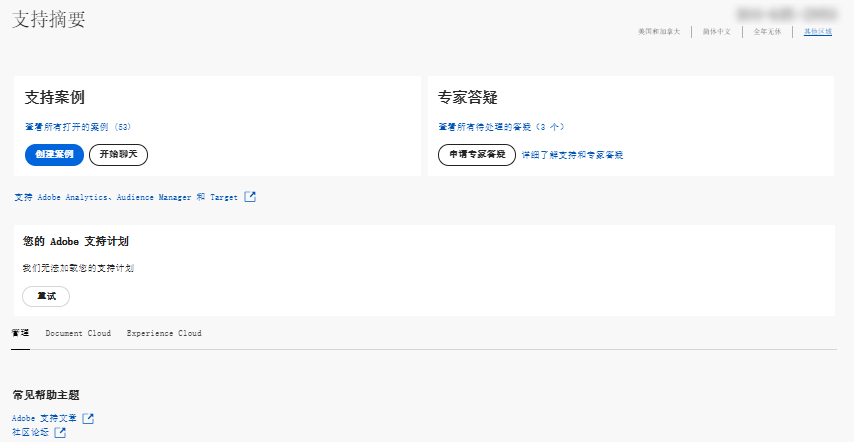

# 企业和团队 |联系Adobe客户关怀

要联系Adobe客户关怀，请导航到 **支持** 选项卡 [Admin Console](https://adminconsole.adobe.com/).

的 **“支持”选项卡** 在 [Admin Console](https://adminconsole.adobe.com/) 允许您通过简单易用的界面访问各种支持选项。 “支持”选项卡中的可用选项取决于您的订阅计划。 有关更多信息，请单击 **了解更多** 对应于您的订阅计划。

如果您不确定您的订阅计划，请导航到 **“支持”选项卡** 在 [Admin Console](https://adminconsole.adobe.com/)，并将您的视图与以下图像进行比较。 然后，单击相应的 **了解更多** 链接。

## 适用于团队帐户

[了解更多](https://helpx.adobe.com/enterprise/using/support-for-teams.html)

## 对于企业帐户

[了解更多](https://helpx.adobe.com/enterprise/using/support-for-enterprise.html)

## 对于Experience Cloud

[了解更多](https://www.adobe.com/go/ac_ec_not_supported_en)
