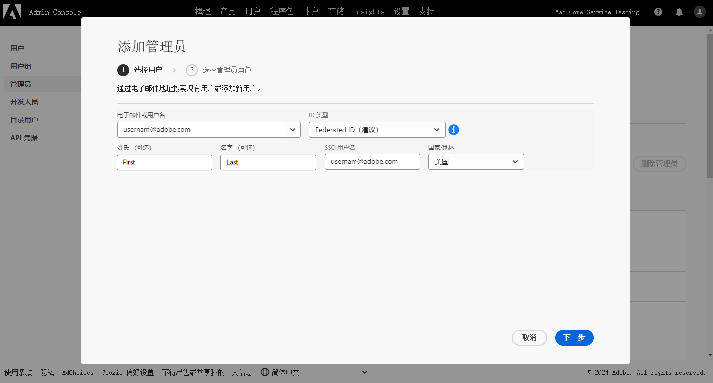

# Adobe 客户支持体验

## Admin Console 支持票证

现在可以通过 [Admin Console](https://adminconsole.adobe.com/) 提交支持票证。有关如何提交支持票证的说明，请查看 [提交支持票证](#submit-ticket)部分.

我们正在努力改进您与 Adobe 客户支持的互动方式。我们的愿景是使用 Adobe Admin Console，通过将支持体验迁移到单一入口点来将其简化。一旦上线，您的组织将可以轻松访问 Adobe 客户支持；通过公共系统更深入地了解您的服务历史；并且，在一个单一门户内，通过电话、网络和聊天请求帮助。

## 如何提交 Admin Console 支持票证 {#submit-ticket}

要在 [Admin Console](https://adminconsole.adobe.com/)内提交支持票证，您需要系统管理员分配给您支持管理员角色。只有您组织中的系统管理员才能分配此角色。产品、产品配置文件和其他管理角色无法分配支持管理员角色，因此无法查看用于提交支持票证的 **[!UICONTROL 创建案例]** 选项。请访问 [企业和团队客户关怀](customer-care.md) 文档，查阅更多相关信息。

### 分配支持管理员角色

支持管理员角色是一个非管理员角色，可以访问与支持有关的信息。支持管理员可以查看、创建和管理问题报告。

要添加或邀请管理员：

1. 在 Admin Console 中，选择&#x200B;**[!UICONTROL 用户]** > **[!UICONTROL 管理员]**。
1. 单击&#x200B;**[!UICONTROL 添加管理员]**。
1. 输入名称或电子邮件地址。

   您可以搜索现有用户，或通过指定有效的电子邮件地址并在屏幕上填写信息来添加新用户。

   

1. 单击&#x200B;**[!UICONTROL 下一步]**。出现管理员角色列表。

要为用户分配支持管理员角色（使用户能够联系支持人员），请执行以下操作：

1. 选择&#x200B;**[!UICONTROL 支持管理员]**&#x200B;选项。

   

1. 选择以下两个选项之一：

   * 选项 1：**[!UICONTROL 基本支持管理员]**。如果要授予用户对所有解决方案（Marketo Engage 除外）的支持访问权限，请选择此选项。
   * 选项 2：**[!UICONTROL 产品支持管理员]**：选择此选项对应 Marketo Engage 支持。选择要授予用户支持访问权限的 Marketo Engage 实例。

   

1. 作出选择后，单击&#x200B;**[!UICONTROL 保存]**。

用户会收到来自 `message@adobe.com` 的有关新管理权限的电子邮件邀请。

用户必须单击&#x200B;**开始使用**（电子邮件）以加入组织。如果新管理员不使用&#x200B;**开始使用**&#x200B;链接，则将无法登录到 Admin Console。

在登录过程中，如果用户还没有 Adobe 配置文件，则可能会要求其设置 Adobe 配置文件。如果用户的电子邮件地址关联了多个配置文件，则用户必须选择&#x200B;**加入团队**（如果出现提示），然后选择与新组织关联的配置文件。

有关详细信息，请参阅管理角色文档中的[编辑企业管理员角色](admin-roles.md#add-enterprise-role)说明。请注意，只有贵组织的系统管理员才能分配此角色。有关管理层级的详细信息，请访问 [管理角色](admin-roles.md) 文档。

### 使用 Admin Console 创建支持票证

如要通过 [Admin Console](https://adminconsole.adobe.com/)创建票证，请选择位于顶部导航中的 **[!UICONTROL 支持]** 选项卡。[!UICONTROL 支持摘要] 页面就会出现。接下来，请选择 **[!UICONTROL 创建案例]** 选项。

>[!TIP]
>
> 如果您无法看到 **[!UICONTROL 创建案例]** 选项或 **[!UICONTROL 支持]** 选项卡，您需要联系系统管理员，让其为您分配支持管理员角色。

出现一个对话框，允许您选择问题类型。请选择最能描述您的问题或疑问的问题类型，然后在右下方选择 **[!UICONTROL 创建案例]**。

出现 **[!UICONTROL 创建案例]** 对话框。系统会要求您提供一些信息，如产品、优先级、描述，以及附加任何屏幕截图，以帮助描述此问题。选择 **[!UICONTROL 下一个]**，继续流程。

>[!NOTE]
>
> 如果问题导致生产系统停止运行或极其严重的中断，我们会提供电话号码以提供即时帮助。

下一页允许您填写联系信息，并提供 Adobe 客户支持与您联系的最佳时间。完成后，选择 **[!UICONTROL 提交]**，您的票证将发送至 Adobe 客户支持。

<!--

## What About the Legacy Systems?

New Tickets/Cases will no longer be able to be submitted in legacy systems as of May 11th.  The [Admin Console](https://adminconsole.adobe.com/) will be used to submit new tickets/cases.

### Existing Tickets/Cases

* Between May 11th and May 20th the legacy systems will remain available to work existing tickets/cases to completion.
* Beginning May 20th the support team will migrate remaining open cases from the legacy systems to the new support experience.  You will receive an email notification regarding how to contact support to continue to work these cases.
-->
