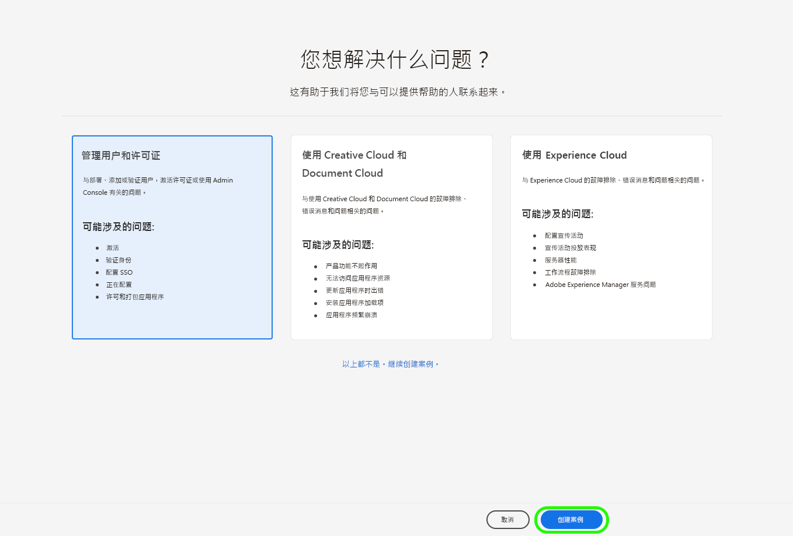
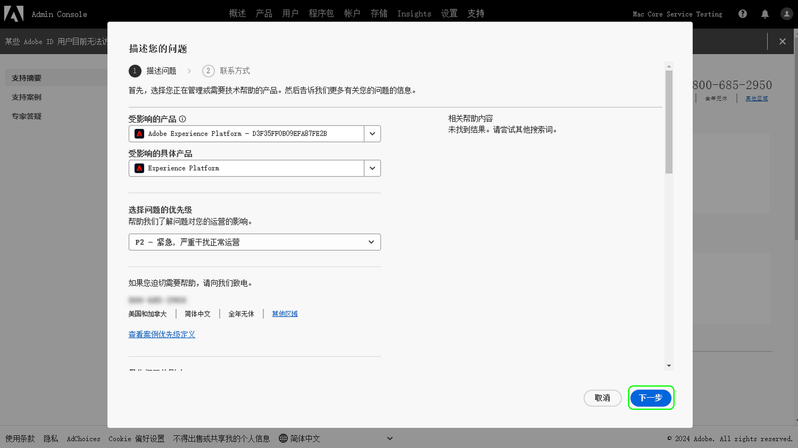

# Adobe 客户支持体验

## Admin Console 支持票证

现在可以通过 [Admin Console](https://adminconsole.adobe.com/) 提交支持票证。有关如何提交支持票证的说明，请查看 [提交支持票证](#submit-ticket)部分.

我们正在努力改进您与 Adobe 客户支持的互动方式。我们的愿景是使用 Adobe Admin Console，通过将支持体验迁移到单一入口点来将其简化。一旦上线，您的组织将可以轻松访问 Adobe 客户支持；通过公共系统更深入地了解您的服务历史；并且，在一个单一门户内，通过电话、网络和聊天请求帮助。

## 是否需要有关新支持平台的帮助？

我们提供一系列在线会议，客户可在其中就新支持流程提出问题。选择一个或多个加入：

| 日期和时间 | 注册链接 |
|--- |--- |
| 4月7日，星期四早8点 | [事件链接](https://event.on24.com/wcc/r/3723732/5288A3B031AD858BF241EB0C0057CD85) |
| 4月7日，星期四下午5点 | [事件链接](https://event.on24.com/wcc/r/3723733/286EFEA9E8D9B6BB49464862F5414B8C) |
| 4月20日，星期三早8点 | [事件链接](https://event.on24.com/wcc/r/3712143/05DAF046E4BB864E7C313B056ADE4EB2) |
| 4月20日，星期三下午5点 | [事件链接](https://event.on24.com/wcc/r/3723740/A9EDA45FA61D3FFC4BF713419B677F16) |
| 4月21日，星期四早8点 | [事件链接](https://event.on24.com/wcc/r/3723741/C7EBCD38583D4D7AFCBD56029EB17C98) |
| 4月21日，星期四下午5点 | [事件链接](https://event.on24.com/wcc/r/3723743/6F41ED2648A621F1419A56F0A52F4446) |

{style=&quot;table-layout:auto&quot;}

## 如何提交 Admin Console 支持票证 {#submit-ticket}

要在 [Admin Console](https://adminconsole.adobe.com/)内提交支持票证，您需要系统管理员分配给您支持管理员角色。只有您组织中的系统管理员才能分配此角色。产品、产品配置文件和其他管理角色无法分配支持管理员角色，因此无法查看用于提交支持票证的 **[!UICONTROL 创建案例]** 选项。请访问 [企业和团队客户关怀](customer-care.md) 文档，查阅更多相关信息。

### 分配支持管理员角色

支持管理员角色是一个非管理员角色，可以访问与支持有关的信息。支持管理员可以查看、创建和管理问题报告。

要分配支持管理员角色，请按照管理角色文档中的 [编辑企业管理员角色](admin-roles.md#add-enterprise-role) 说明进行操作。请注意，只有贵组织的系统管理员才能分配此角色。有关管理层级的详细信息，请访问 [管理角色](admin-roles.md) 文档。

### 使用 Admin Console 创建支持票证

如要通过 [Admin Console](https://adminconsole.adobe.com/)创建票证，请选择位于顶部导航中的 **[!UICONTROL 支持]** 选项卡。[!UICONTROL 支持摘要] 页面就会出现。接下来，请选择 **[!UICONTROL 创建案例]** 选项。

>[!TIP]
>
> 如果您无法看到 **[!UICONTROL 创建案例]** 选项或 **[!UICONTROL 支持]** 选项卡，您需要联系系统管理员，让其为您分配支持管理员角色。

出现一个对话框，允许您选择问题类型。请选择最能描述您的问题或疑问的问题类型，然后在右下方选择 **[!UICONTROL 创建案例]**。

出现 **[!UICONTROL 创建案例]** 对话框。系统会要求您提供一些信息，如产品、优先级、描述，以及附加任何屏幕截图，以帮助描述此问题。选择 **[!UICONTROL 下一个]**，继续流程。

>[!NOTE]
>
> 如果问题导致生产系统停止运行或极其严重的中断，我们会提供电话号码以提供即时帮助。

下一页允许您填写联系信息，并提供 Adobe 客户支持与您联系的最佳时间。完成后，选择 **[!UICONTROL 提交]**，您的票证将发送至 Adobe 客户支持。

<!--

## What About the Legacy Systems?

New Tickets/Cases will no longer be able to be submitted in legacy systems as of May 11th.  The [Admin Console](https://adminconsole.adobe.com/) will be used to submit new tickets/cases.

### Existing Tickets/Cases

* Between May 11th and May 20th the legacy systems will remain available to work existing tickets/cases to completion.
* Beginning May 20th the support team will migrate remaining open cases from the legacy systems to the new support experience.  You will receive an email notification regarding how to contact support to continue to work these cases.
-->
