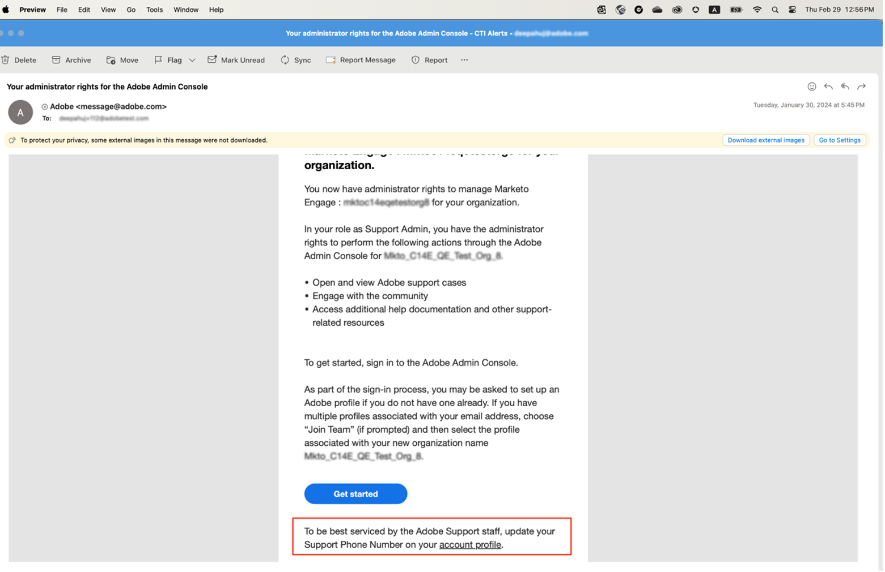
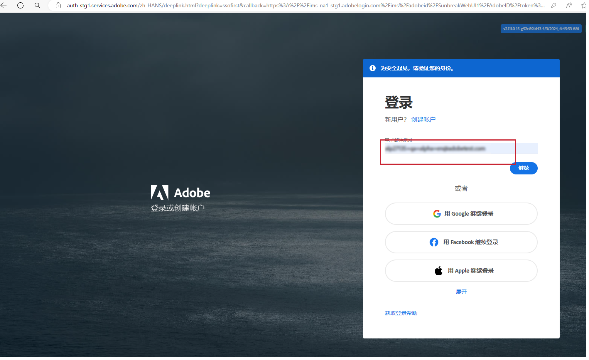
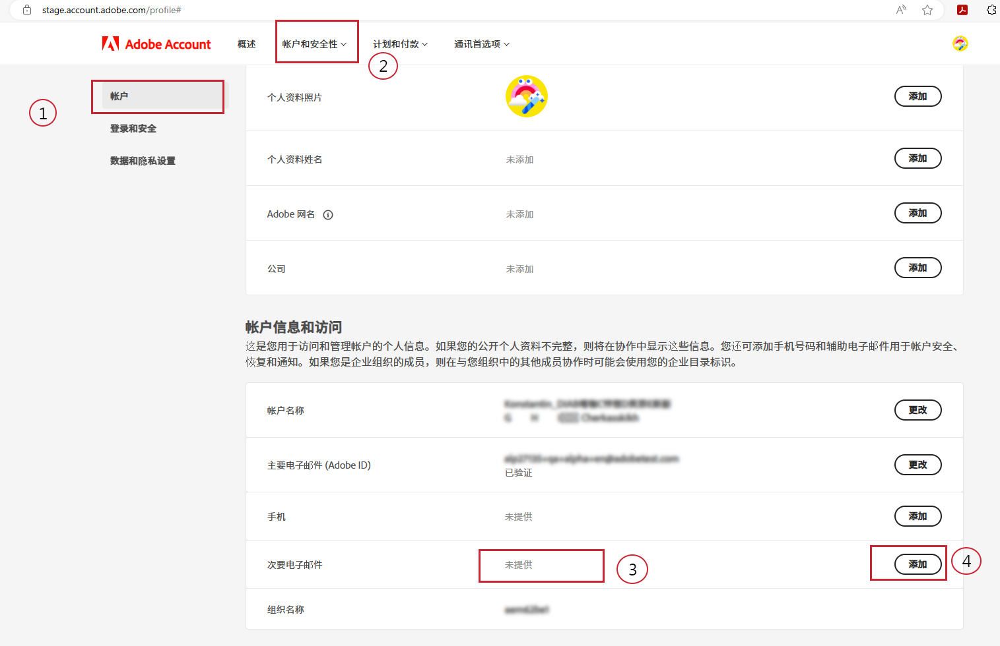
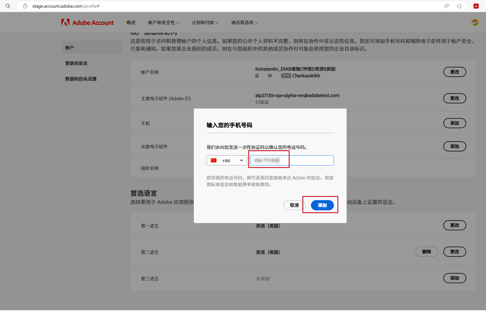
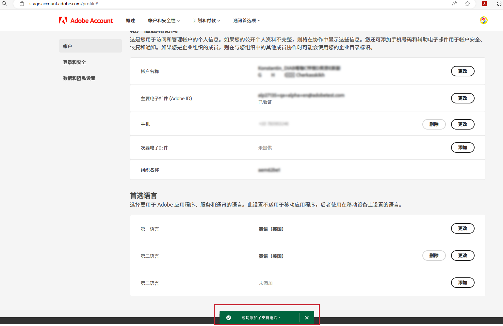

# 指定首选支持电话号码

被分配“管理员”角色（如“产品支持管理员”）后，您应该会收到一封电子邮件，通知您已具备“管理员”权限，可管理已授予您管理员权限的相应实例。

该电子邮件现在包含以下红色文本，说明如何转到您的帐户个人资料并与提供您的首选支持电话号码。

要指定首选电话号码：

1. 请单击&#x200B;**帐户个人资料**&#x200B;链接以打开新窗口，使用 `account.adobe.com` 登录。

   

1. 完成登录过程并进入 `account.adobe.com` 上的以下屏幕。
1. 然后单击以下选项卡“帐户和安全性”>“帐户”，以查看“支持电话号码”字段。
1. 在此处添加一个电话号码，以便我们识别您的支持需求。

